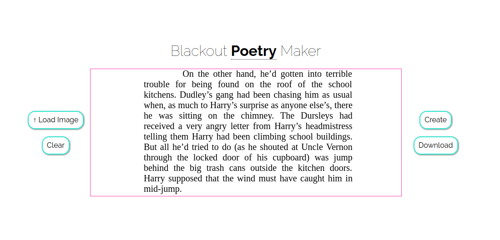
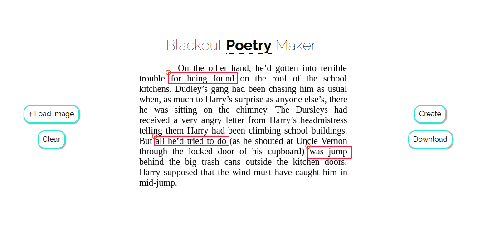
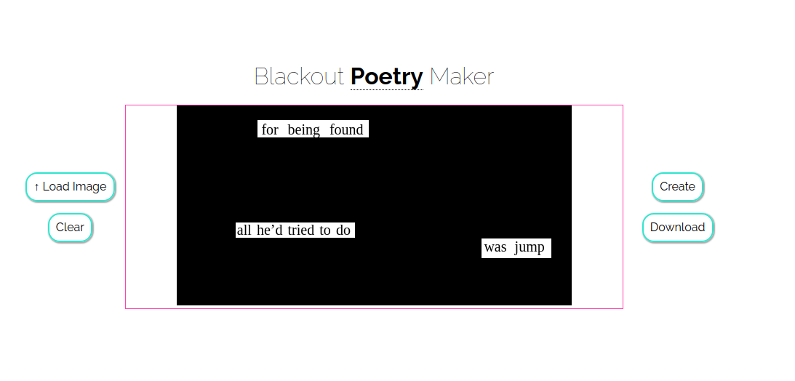

# Blackout Poetry Maker

Drag over the words you wanna keep, and it'll blacken the rest of them. :blue_heart:

:tada:

### Mobile Support
Coming Soon. See [#1](https://github.com/abhisheksoni27/blackout-poetry-maker/issues/1)